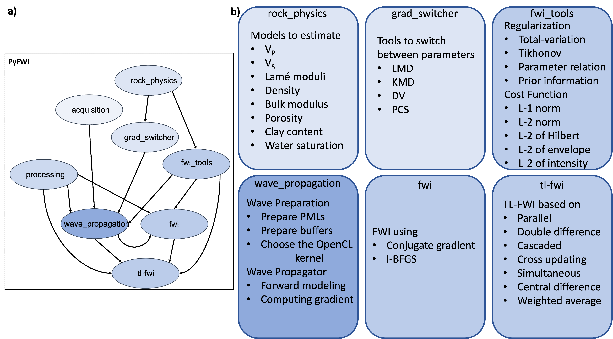

# PyFWI
[](https://badge.fury.io/py/PyFWI)
[](https://www.gnu.org/licenses/gpl-3.0)
[](https://pyfwi.readthedocs.io/en/latest/?badge=latest)
[](https://zenodo.org/badge/latestdoi/402170735)
[](https://pepy.tech/project/pyfwi)


This repository contains Python package for elastic seismic full-waveform inversion (FWI) and time-lapse FWI.
Documentation of PyFWI is available [here](https://pyfwi.readthedocs.io/en/latest/index.html).


## Installation
To install this package, run 
```
python3 -m pip install PyFWI
```
on macOS or 
```
py -m pip install PyFWI
```
on Windows.

The structure of PyFWI can be shown as



## Citing PyFWI
```
@article{mardan2023pyfwi,
  title = {PyFWI: {A Python} package for full-waveform inversion and reservoir monitoring},
  author = {Mardan, Amir and Giroux, Bernard and Fabien-Ouellet, Gabriel},
  journal = {SoftwareX},
  volume = {22},
  pages = {101384},
  year = {2023},
  publisher = {Elsevier},
  doi = {10.1016/j.softx.2023.101384}
}
```
