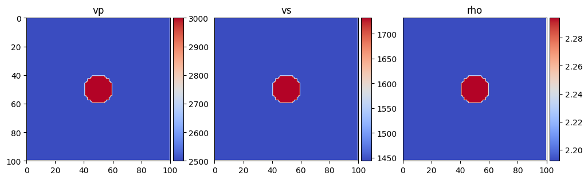
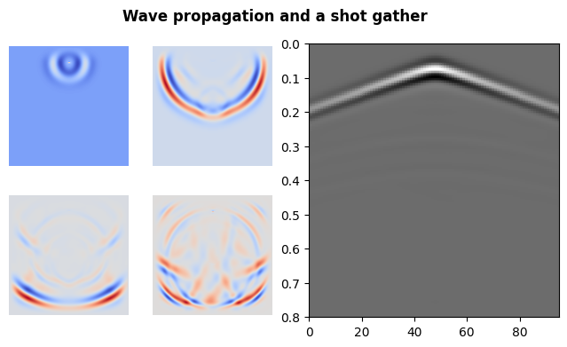
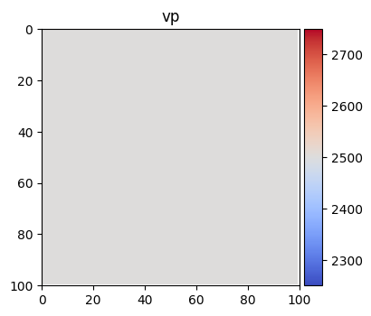
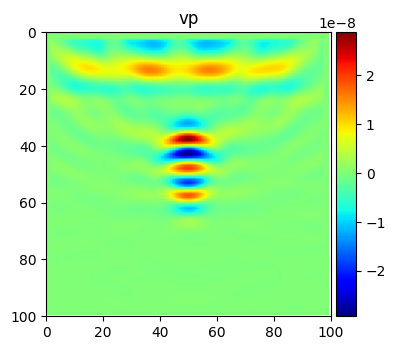

Installation
============

PyFWI can be installed using ``pip`` as

.. code:: console

       (.venv) $ pip install PyFWI

on macOS or

.. code:: console

       (.venv) $ py -m pip install PyFWI

on Windows.

Simple Gradient Computation
============================

In this section we see some applications of PyFWI. First, forward
modeling is shown and then we estimate gradient of cost funtion with
respect to :math:`V_P`.

**1. Forward modeling**

In this simple example, we use PyFWI to do forward modeling. So, we need
to first import the following packages amd modulus.

.. code:: ipython3

    import matplotlib.pyplot as plt
    import numpy as np
    
    import PyFWI.wave_propagation as wave
    import PyFWI.acquisition as acq
    import PyFWI.seiplot as splt
    import PyFWI.model_dataset as md
    import PyFWI.fwi_tools as tools
    import PyFWI.processing as process
    

A simple model can be created by using ``model_dataset`` module as

.. code:: ipython3

    Model = md.ModelGenerator('louboutin')
    model = Model()
    
    im = splt.earth_model(model, cmap='coolwarm')

Then we need to create an input dictionary as follow

.. code:: ipython3

    model_shape = model[[*model][0]].shape
    
    inpa = {
        'ns': 1,  # Number of sources
        'sdo': 4,  # Order of FD
        'fdom': 15,  # Central frequency of source
        'dh': 7,  # Spatial sampling rate
        'dt': 0.004,  # Temporal sampling rate
        'acq_type': 1,  # Type of acquisition (0: crosswell, 1: surface, 2: both)
        't': 0.8,  # Length of operation
        'npml': 20,  # Number of PML 
        'pmlR': 1e-5,  # Coefficient for PML (No need to change)
        'pml_dir': 2,  # type of boundary layer 
    }
    
    seisout = 0 # Type of output 0: Pressure
    
    inpa['rec_dis'] =  1 * inpa['dh']  # Define the receivers' distance

Now, we obtain the location of sources and receivers based on specified
parameters.

.. code:: ipython3

    offsetx = inpa['dh'] * model_shape[1]
    depth = inpa['dh'] * model_shape[0]
    
    src_loc, rec_loc = acq.surface_seismic(inpa['ns'], inpa['rec_dis'], offsetx,
                                                          inpa['dh'], inpa['sdo'])        
    src_loc[:, 1] -= 5 * inpa['dh']
    
    # Create the source
    src = acq.Source(src_loc, inpa['dh'], inpa['dt'])
    src.Ricker(inpa['fdom'])

Finally, we can have the forward modelling as

.. code:: ipython3

    # Create the wave object
    W = wave.WavePropagator(inpa, src, rec_loc, model_shape, components=seisout, chpr=20)
    
    # Call the forward modelling 
    d_obs = W.forward_modeling(model, show=False)  # show=True can show the propagation of the wave

To compute the gradient using the adjoint-state method, we need to save
the wavefield during the forward wave propagation. This must be done for
the wavefield obtained from estimated model. For example, the wavefield
at four time steps are presented here in addition to a shot gather.

.. code:: ipython3

    fig = plt.figure(figsize=(8, 4))
    
    count = 1
    
    ax = fig.add_subplot(122)
    ax = splt.seismic_section(ax, d_obs['taux'], t_axis=np.linspace(0, inpa['t'], int(1 + inpa['t'] // inpa['dt'])))
    
    ax_loc = [1, 2, 5, 6]
    snapshots = [40, 80, 130, 180]
    
    for i in range(len(snapshots)):
        ax = fig.add_subplot(2, 4, ax_loc[i])
        ax.imshow(W.W['taux'][:, :, 0, snapshots[i]], cmap='coolwarm')
        
        ax.axis('off')
        count += 1
    fig.suptitle("Wave propagation and a shot gather", fontweight='bold');

**2. Gradient**

To compute the gradient, we need the observed data and an initial model.
So, first we obtain the observed data using more sources.

**Note:** For better visualization and avoiding crosstalk, I compute the
gradient in acoustic media.

.. code:: ipython3

    # Making medium acoustic
    model['vs'] *= 0.0
    model['rho'] = np.ones_like(model['rho'])
    
    # Increasing number of sources
    inpa['ns'] = 5
    
    src_loc, rec_loc = acq.surface_seismic(inpa['ns'], inpa['rec_dis'], offsetx,
                                                          inpa['dh'], inpa['sdo'])        
    src_loc[:, 1] -= 5 * inpa['dh']
    
    # Create the source
    src = acq.Source(src_loc, inpa['dh'], inpa['dt'])
    src.Ricker(inpa['fdom'])
    
    # Create the wave object
    W = wave.WavePropagator(inpa, src, rec_loc, model_shape, components=seisout, chpr=20)
    
    # Call the forward modelling 
    db_obs = W.forward_modeling(model, show=False)  # show=True can show the propagation of the wave
    
    # preparing data amd applying gain if required
    db_obs = process.prepare_residual(db_obs, 1)

Then we create the initial model.

.. code:: ipython3

    m0 = Model(smoothing=1)
    m0['vs'] *= 0.0
    m0['rho'] = np.ones_like(model['rho'])
    
    im = splt.earth_model(m0, ['vp'], cmap='coolwarm')

And we simulate the wave propagation to obtain estimated data. For
computing the gradient, we can smooth the gradient and scale it by
defining ``g_smooth`` and ``energy_balancing``.

.. code:: ipython3

    inpa['energy_balancing'] = True

We save the wavefield at 20% of the time steps (``chpr = 20``) to be
used for gradient calculation. The value of wavefield is accessible
using the attribute ``W`` which is a dictionary for :math:`V_x`,
:math:`V_z`, :math:`\tau_x`, :math:`\tau_z`, and :math:`\tau_{xz}` as
``vx``, ``vz``, ``taux``, ``tauz``, and ``tauxz``. Each parameter is a
4D tensor. For example, we can have access to the last time step of
:math:`\tau_x` for the first shot as ``W.W['taux'][:, :, 0, -1]``.

.. code:: ipython3

    Lam = wave.WavePropagator(inpa, src, rec_loc, model_shape,
                              chpr=20, components=seisout)
    
    d_est = Lam.forward_modeling(m0, False)
    d_est = process.prepare_residual(d_est, 1)

Now, we define the cost function and obtaine the residuals for
adjoint-state method.

.. code:: ipython3

    CF = tools.CostFunction('l2')
    rms, adj_src = tools.cost_seismic(d_est, db_obs, fun=CF)
    # print(rms)

Using the adjoint source, we can estimate the gradient as

.. code:: ipython3

    grad = Lam.gradient(adj_src, show=False)

.. code:: ipython3

    # Time to plot the results
    splt.earth_model(grad, ['vp'], cmap='jet');

