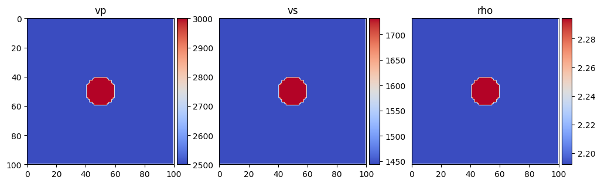
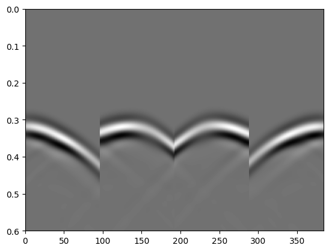
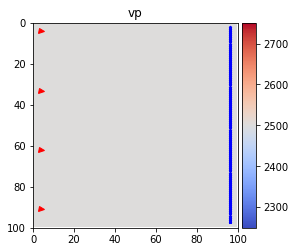
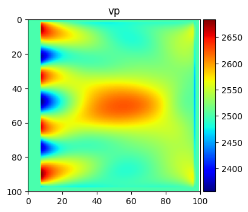

Simple FWI Example
==================

In this section we see application of PyFWI for performin FWI. First,
forward modeling is shown and then we estimate a model of subsurface
using FWI.

**1. Forward modeling**

In this simple example, we use PyFWI to do forward modeling. So, we need
to first import the following packages amd modulus.

.. code:: ipython3

    import matplotlib.pyplot as plt
    import numpy as np
    
    import PyFWI.wave_propagation as wave
    import PyFWI.acquisition as acq
    import PyFWI.seiplot as splt
    import PyFWI.model_dataset as md
    import PyFWI.fwi_tools as tools
    import PyFWI.processing as process
    from PyFWI.fwi import FWI
    

A simple model can be created by using ``model_dataset`` module as

.. code:: ipython3

    Model = md.ModelGenerator('louboutin')
    model = Model()
    
    im = splt.earth_model(model, cmap='coolwarm')

Then we need to create an input dictionary as follow

.. code:: ipython3

    model_shape = model[[*model][0]].shape
    
    inpa = {
        'ns': 4,  # Number of sources
        'sdo': 4,  # Order of FD
        'fdom': 15,  # Central frequency of source
        'dh': 7,  # Spatial sampling rate
        'dt': 0.004,  # Temporal sampling rate
        'acq_type': 0,  # Type of acquisition (0: crosswell, 1: surface, 2: both)
        't': 0.6,  # Length of operation
        'npml': 20,  # Number of PML 
        'pmlR': 1e-5,  # Coefficient for PML (No need to change)
        'pml_dir': 2,  # type of boundary layer
        'device': 1, # The device to run the program. Usually 0: CPU 1: GPU
    }
    
    seisout = 0 # Type of output 0: Pressure
    
    inpa['rec_dis'] =  1 * inpa['dh']  # Define the receivers' distance

Now, we obtain the location of sources and receivers based on specified
parameters.

.. code:: ipython3

    offsetx = inpa['dh'] * model_shape[1]
    depth = inpa['dh'] * model_shape[0]
    
    src_loc, rec_loc, n_surface_rec, n_well_rec = acq.acq_parameters(inpa['ns'], 
                                                                     inpa['rec_dis'], 
                                                                     offsetx,
                                                                     depth,
                                                                     inpa['dh'], 
                                                                     inpa['sdo'], 
                                                                     acq_type=inpa['acq_type'])        
    # src_loc[:, 1] -= 5 * inpa['dh']
    
    # Create the source
    src = acq.Source(src_loc, inpa['dh'], inpa['dt'])
    src.Ricker(inpa['fdom'])

Finally, we can have the forward modelling as

.. code:: ipython3

    # Create the wave object
    W = wave.WavePropagator(inpa, src, rec_loc, model_shape,
                            n_well_rec=n_well_rec,
                            components=seisout, chpr=0)
    
    # Call the forward modelling 
    d_obs = W.forward_modeling(model, show=False)  # show=True can show the propagation of the wave

.. code:: ipython3

    plt.imshow(d_obs["taux"], cmap='gray', 
               aspect="auto", extent=[0, d_obs["taux"].shape[1], inpa['t'], 0])

.. parsed-literal::

    <matplotlib.image.AxesImage at 0x15144c760>

**2. FWI**

To perform FWI, we need the observed data and an initial model.

**Note:** For better visualization and avoiding crosstalk, I compute the
gradient in acoustic media.

Here is a homogeneous initial model.

.. code:: ipython3

    m0 = Model(smoothing=1)
    m0['vs'] *= 0.0
    m0['rho'] = np.ones_like(model['rho'])
    
    fig = splt.earth_model(m0, ['vp'], cmap='coolwarm')
    
    fig.axes[0].plot(src_loc[:,0]//inpa["dh"], 
                     src_loc[:,1]//inpa["dh"], "rv", markersize=5)
    
    fig.axes[0].plot(rec_loc[:,0]//inpa["dh"], 
                     rec_loc[:,1]//inpa["dh"], "b*", markersize=3)

.. parsed-literal::

    [<matplotlib.lines.Line2D at 0x158434ee0>]

Now, we can create a FWI object,

.. code:: ipython3

    fwi = FWI(d_obs, inpa, src, rec_loc, model_shape, 
              components=seisout, chpr=20, n_well_rec=n_well_rec)

and call it by providing the initial model ``m0``, observed data
``d_obs``, optimization method ``method``, desired frequencies for
inversion, number of iterations for each frequency, number of parameters
for inversion ``n_params``, index of the first parameter ``k_0``, and
index of the last parameter ``k_end``. For example, if we have an
elastic model, but we want to only invert for P-wave velocity, these
parameters should be defined as

.. code:: python

   n_params = 1
   k_0 = 1
   k_end = 2

If we want to invert for P-wave velocity and then :math:`V_S`, these
parameters should be defined as

.. code:: python

   n_params = 1
   k_0 = 1
   k_end = 3

and for simultaneously inverting for these two parameters, we define
these parameters as

.. code:: python

   n_params = 2
   k_0 = 1
   k_end = 3

Let's call the FWI object,

.. code:: ipython3

    m_est, _ = fwi(m0, method="lbfgs", 
                     freqs=[25, 45], iter=[2, 2], 
                     n_params=1, k_0=1, k_end=2)

.. code:: ipython3

    # Time to plot the results
    fig = splt.earth_model(m_est, ['vp'], cmap='jet')

